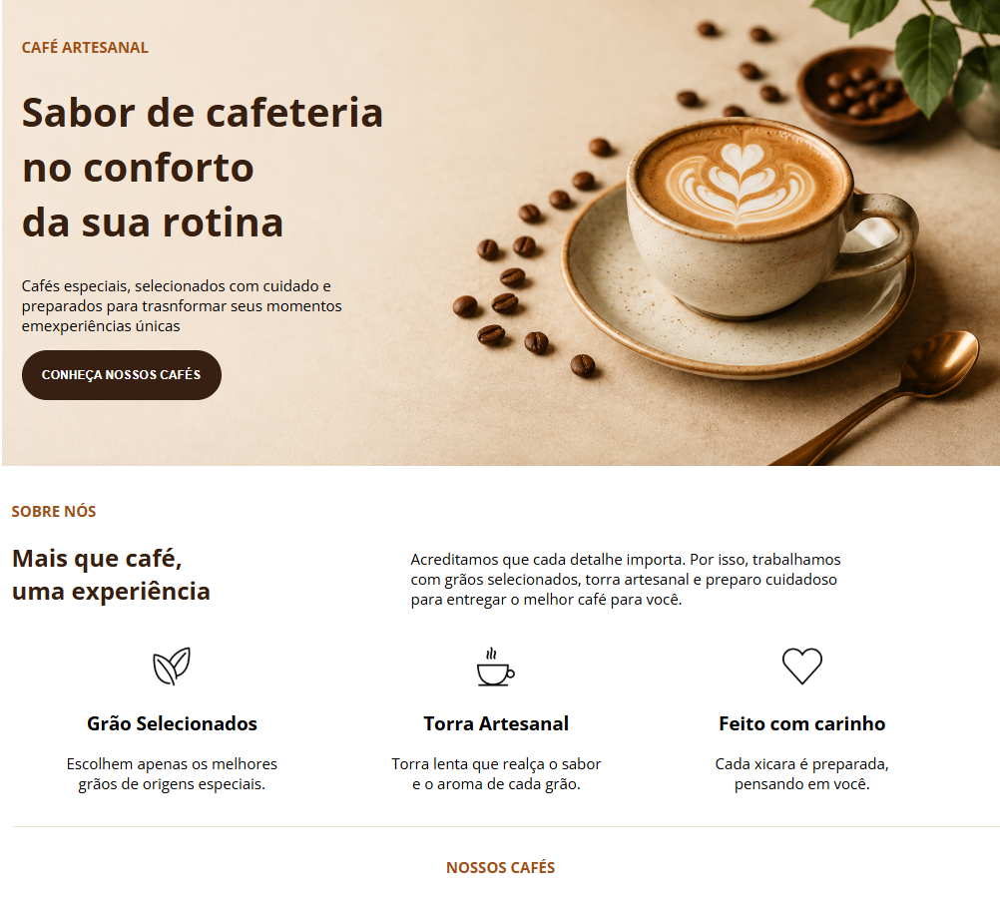

# ☕ Café Artesanal

Landing Page desenvolvida para praticar HTML5 e CSS3.

## 📸 Preview

## 🚀 Tecnologias

- HTML5
- CSS3
- Google Fonts

## 📚 Conceitos praticados

- Box Model
- Combinators
- Position Relative
- Position Absolute
- Pseudo-classes
- Estrutura Semântica

## 🌐 Projeto Online

<a href="https://kauanemota.github.io/landing-page-cafe-aurora/">Ver projeto online</a>

## 👩‍💻 Autora

Feito por Kauane Mota

🔗 GitHub: https://github.com/kauanemota
